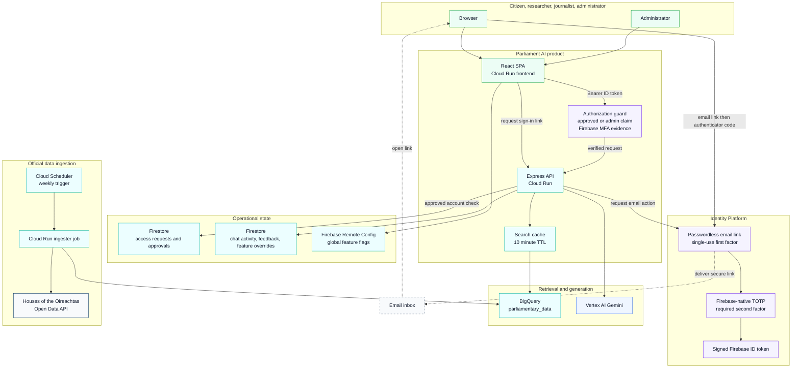
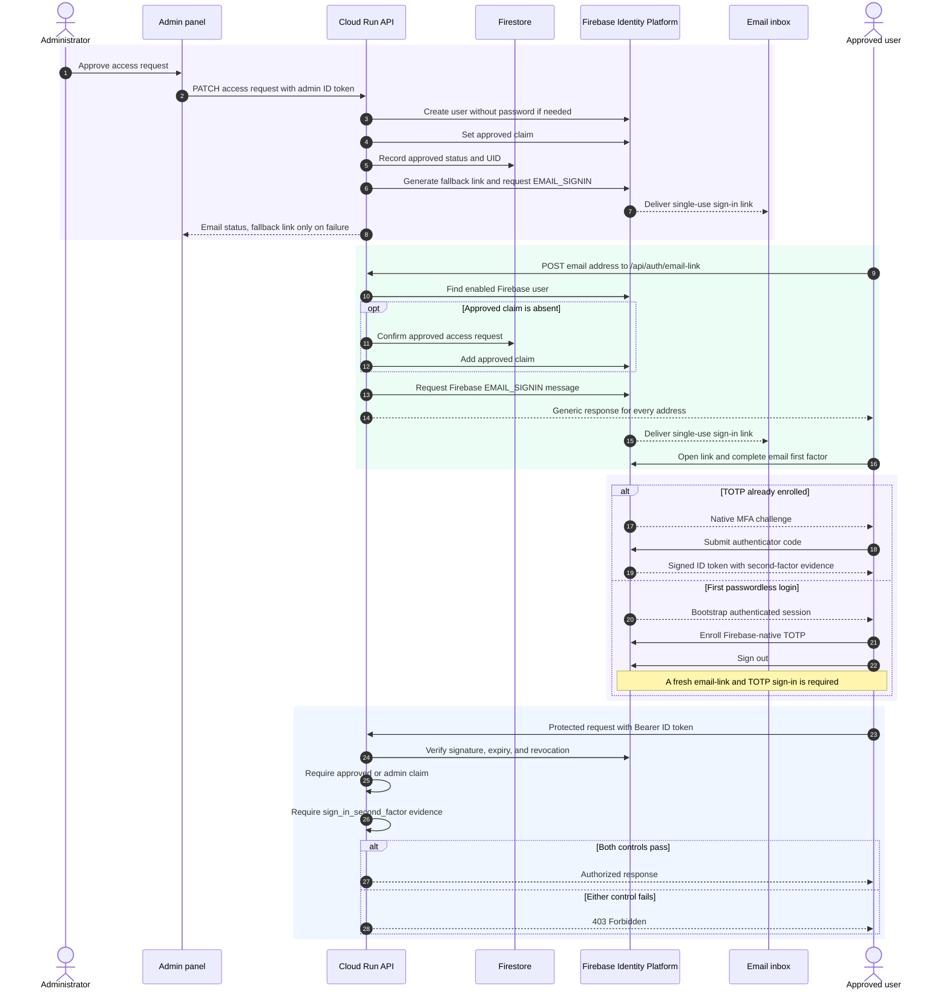
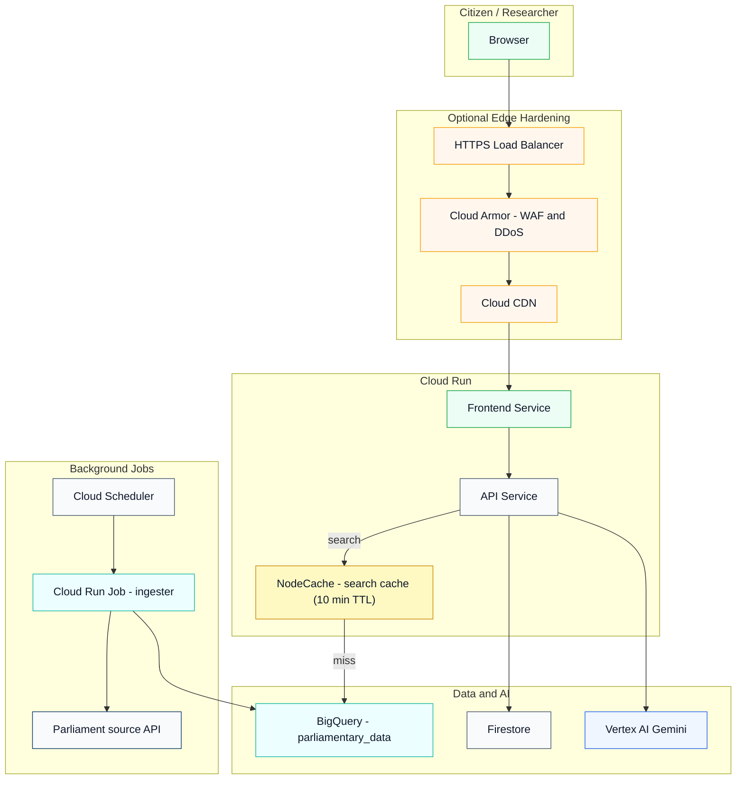

# Platform Architecture
_Updated: 2026-08-16_

Parliament AI is a two-service Cloud Run application backed by BigQuery retrieval, Vertex AI generation, passwordless Firebase Identity Platform authentication, and a weekly ingestion pipeline.

---

## Standard deployment



**Notes**
- NodeCache is in-process within the API Service; cache hits bypass BigQuery (10 min TTL).
- Firebase Identity Platform uses a single-use email link as the first factor and Firebase-native TOTP as the required second factor.
- Per-user feature flag overrides are stored in Firestore `feature_overrides/{flagKey}` and take precedence over Remote Config global values.
- Firebase delivers authentication links. Resend remains separate from the authentication trust boundary for non-authentication notifications.

---

## Authentication and access control

All users must be approved by an admin. Accounts are created without passwords, and the public email-link endpoint returns the same response for approved and unknown addresses.



### Admin identity

- Admin identity is a Firebase custom claim: `{ admin: true }`.
- Set via `node scripts/set-admin-claim.mjs <email>`.
- Verified server-side on every `/api/admin/*` call by `requireAuth` + `requireAdmin` middleware in `adminAPI.ts`.
- Claim takes effect after sign-out and back in (new JWT required).

---

## Feature flags

Two-layer system: global defaults via Remote Config, per-user overrides via Firestore.

| Flag | Default | Controls |
|------|---------|----------|
| `ff_access_analytics_page` | false | Analytics page visible |
| `ff_access_feedback` | false | Feedback controls on Research page |
| `ff_quota_daily_limit` | false | Per-user daily query limit enforcement |

`useFeatureFlag(flag)` checks Firestore `feature_overrides/{flag}` first; if the user UID is in the `users` array, the override applies. Otherwise Remote Config value is used.

---

## Admin API endpoints

All endpoints require `Authorization: Bearer <Firebase ID token>` with `admin: true` custom claim.

| Method | Path | Purpose |
|--------|------|---------|
| GET | `/api/admin/users` | List Firebase Auth accounts |
| POST | `/api/admin/users` | Create a passwordless user and send a sign-in link; return a fallback link only if delivery fails |
| DELETE | `/api/admin/users/:uid` | Delete account |
| POST | `/api/admin/users/:uid/disable` | Disable account |
| POST | `/api/admin/users/:uid/enable` | Re-enable account |
| POST | `/api/admin/users/:uid/revoke-tokens` | Force sign-out all sessions |
| GET | `/api/admin/access-requests` | List pending access requests |
| PATCH | `/api/admin/access-requests/:id` | Approve or deny request |
| GET | `/api/admin/feature-flags` | Current Remote Config values |
| PATCH | `/api/admin/feature-flags` | Toggle a global flag |
| GET | `/api/admin/feature-flag-users` | Per-user overrides for all flags |
| PUT | `/api/admin/feature-flag-users/:key` | Set user list for a flag override |
| GET | `/api/admin/usage` | Usage stats from Firestore |
| GET | `/api/admin/token-limit` | Current daily query limit |
| PATCH | `/api/admin/token-limit` | Update daily query limit |

---

## Firestore collections

| Collection | Purpose |
|-----------|---------|
| `chat_executions` | Per-query execution records (model, cost, timing, filters) |
| `chat_feedback` | Thumbs up/down feedback linked to executions |
| `feedback` | Structured feedback (sentiment, category, verbatim) |
| `feature_overrides` | Per-user early access overrides — document per flag |
| `access_requests` | Access request submissions from the sign-in page |
| `api_usage` | Aggregated API usage records from APIUsageMonitor |

---

## CORS policy

The API allows cross-origin requests only from the comma-separated `CORS_ORIGIN` configuration:

```
https://your-frontend-service-url.run.app
https://your-frontend-service-url.run.app
https://your-project-id.web.app
https://your-project-id.firebaseapp.com
http://localhost:5173
http://localhost:3000
```

The canonical bootstrap sets this value to the deployed frontend URL. Changing origins requires an explicit Cloud Run configuration update.

---

## Hardened edge variant

Optional edge hardening for production deployments where DDoS protection and CDN caching are required.



**Notes**
- This variant does not change the application or runtime model; only the ingress path differs.
- Cloud Armor rules and CDN cache policies are configured separately from the bootstrap scripts.
- See `docs/deployment-guide.md` for the standard deployment path.
