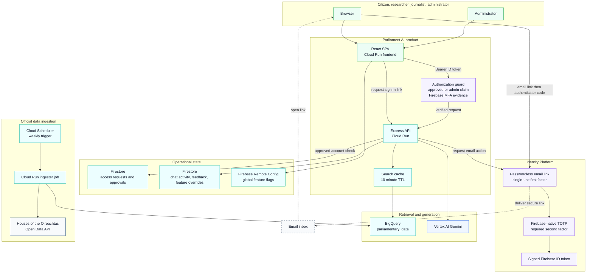

# Parliament Explorer - Architecture Diagram
_Updated: 2026-08-16_

## Notes

- Retrieval is BigQuery-first for cost efficiency.
- Adapter settings are environment driven (`PARLIAMENT_ADAPTER`, `PARLIAMENT_API_BASE_URL`, `PARLIAMENT_NAME`).
- Current ingestion adapter implementation is `oireachtas`.
- Authentication uses Firebase email links plus native TOTP; protected API requests require approval and second-factor evidence.
- Authentication uses Firebase email links plus native TOTP; protected API requests require approval and second-factor evidence.
