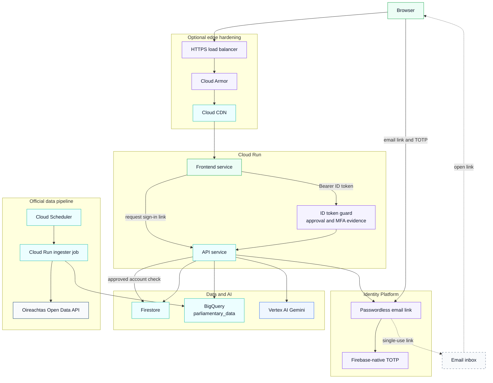

# Parliament Explorer - Architecture Diagram (Hardened Edge Variant)
_Updated: 2026-08-16_

## Notes

- This variant adds edge controls while preserving the same app/runtime model.
- Retrieval remains BigQuery based.
- Edge controls supplement, but do not replace, Firebase email-link authentication, native TOTP, or API claim enforcement.
- Edge controls supplement, but do not replace, Firebase email-link authentication, native TOTP, or API claim enforcement.
