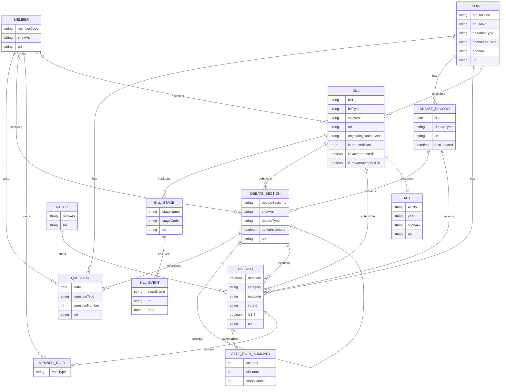

# Oireachtas API – Entity Relationships (with Legislation)

  
**Notes**
- Legislation flow: `BILL` → multiple `BILL_STAGE` → stage `BILL_EVENT`(s); a `BILL` may **become** an `ACT` when enacted.
- Votes on legislation: `DIVISION` can be linked to a `BILL` (where `isBill = true`) and summarized in `VOTE_TALLY_SUMMARY`; member votes appear in `MEMBER_TALLY`.
- Debates: `BILL` can be discussed within specific `DEBATE_SECTION`s of a `DEBATE_RECORD`.
- Questions: retained for completeness and cross-link to debates/sections when provided.
