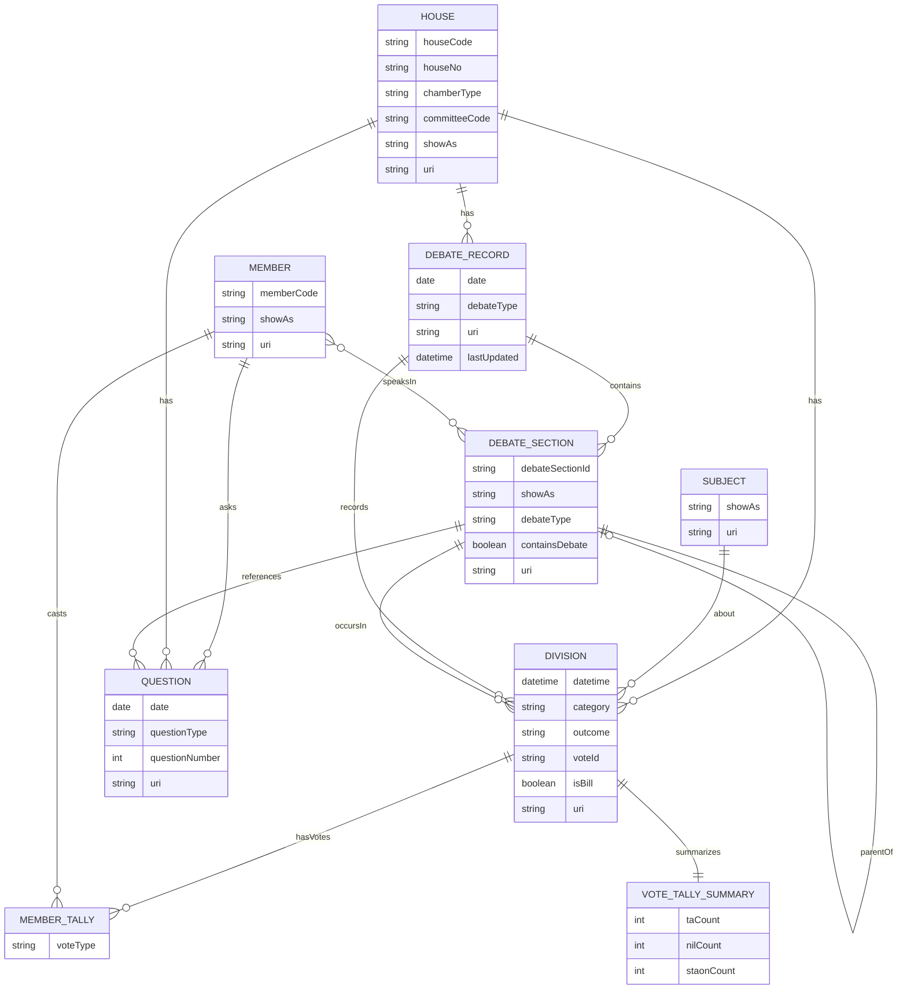

# Oireachtas API – Entity Relationships (with Votes)

  
**Notes**
- `MEMBER_TALLY.voteType` values are typically “Tá”, “Níl”, and “Staon”.
- `VOTE_TALLY_SUMMARY` captures division-level totals derived from `tallies.taVotes.tally`, `tallies.nilVotes.tally`, and `tallies.staonVotes.tally`.
- `SUBJECT` represents the motion text shown as part of a division (e.g., “Question put: ...”).
- A division may appear in the context of a `DEBATE_RECORD` and specific `DEBATE_SECTION`.
